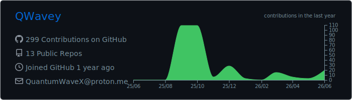
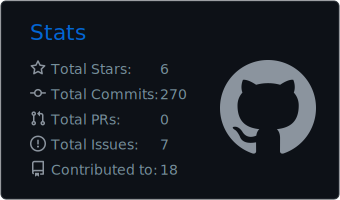
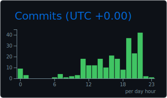
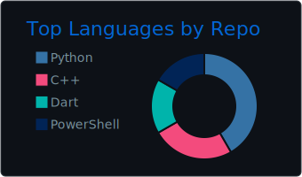
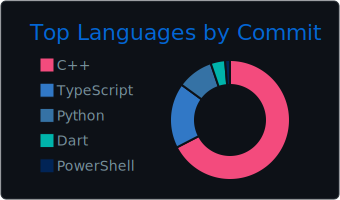

Hey Hey! Greetings from Germany!

I'm QWavey, a friendly developer wanting to make the world a better place by collaborating with friends and innovating in the world of software security and automation. 

Im sitting on an PC and mobile device since I was 6 years old. Pretty young I know... But it still gave me the Experience im waking up with every day! 

Thinking of new Projectideas is very important for me.

## Statistics

## Get in Touch
Feel free to reach out. Just create an Issue somewhere in my Repos if you want to contact me. My discord is : sniper74

## 📊 GitHub Analytics

  

  
  

  
  

  
By exploring my GitHub profile, you'll see my dedication to software development, security research, and the use of technology to make a positive impact on the world!

⚠️ DISCLAIMER
By using any of my codes, you assume full responsibility for any outcome—including system failures, data loss, or unintended damage. Your actions are your own, and you agree that I am not liable for any consequences arising from their use if something goes wrong. If you are unsure or don´t know what to do, consider cancelling what you are doing, or ask a professional/me.

Some of my projects incorporate code, suggestions, or logic generated or assisted by artificial intelligence tools. While I review, test, and refine all output to ensure quality and functionality, I encourage users to exercise their own judgment and due diligence when using my work. I am not just "vibecoding and pushing it out", I do tests and see if it works myself. Sometimes even staying up till midnight. If you don´t like AI Coding, you can move away from my Profile. I understand it.
Ideas are ALWAYS from me and NEVER were a prompt given to AI like: "AI give me project Ideas". While working in a project and having my Ideas completed I sometimes ask AI for new suggestions for Ideas and then I take some looks. They are not selected in 9/10 ways.
